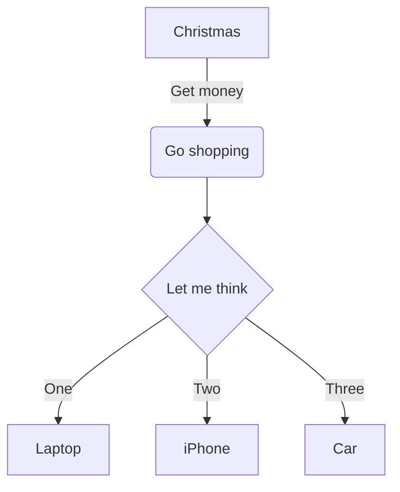
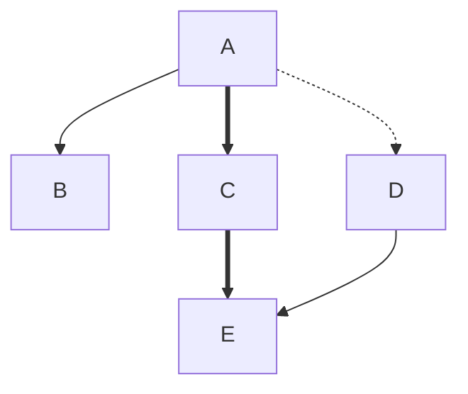
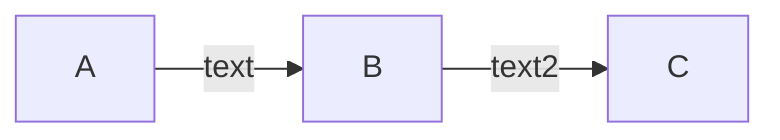
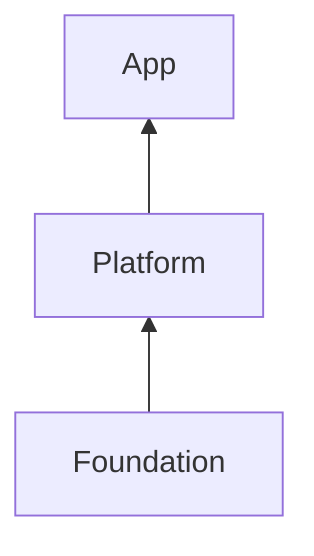
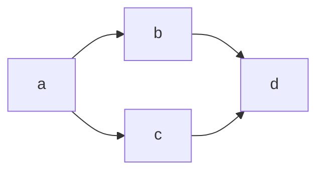
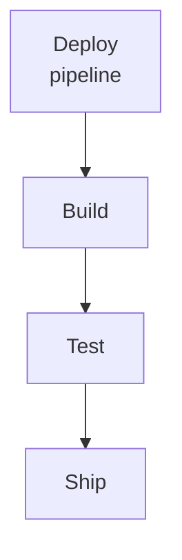

# mascii

Mermaid `flowchart` diagrams into ASCII.

## Example

Given this Mermaid source (`examples/default.mmd`):



`mascii` produces:

```
            ┌───────────┐
            │ Christmas │
            └───────────┘
                  │
              Get money
                  │
                  ▼
           ╭─────────────╮
           │ Go shopping │
           ╰─────────────╯
                  │
                  │
                  ▼
          ╭──────────────╮
          │ Let me think │
          ╰──────────────╯
           │      │     │
          One    Two  Three
        ╭──╯      │     ╰────╮
        ▼         ▼          ▼
┌────────┐    ┌────────┐    ┌─────┐
│ Laptop │    │ iPhone │    │ Car │
└────────┘    └────────┘    └─────┘
```

Square brackets `[...]` render with sharp corners; round `(...)` and diamond `{...}` get rounded corners.

## Edge styles

Normal `-->`, thick `==>`, dotted `-.->`, and invisible `~~~` (layout-only):



```
         ┌───┐
         │ A │
         └───┘
          │┃┊
   ╭──────╯┃╰┄┄┄┄┄┄╮
   ▼       ▼       ▼
┌───┐    ┌───┐    ┌───┐
│ B │    │ C │    │ D │
└───┘    └───┘    └───┘
           ┃        │
           ┣────────╯
           ▼
         ┌───┐
         │ E │
         └───┘
```

Thick edges use heavy box-drawing (`┃ ━ ┏ ┓ ┗ ┛`), dotted use dashed (`┊ ┄`), and invisible edges still constrain the layout (note `B` is placed above `E` even without a visible line).

## Directions

`LR` lays out left-to-right with horizontal arrows; embedded edge labels like
`A -- text --> B` render inline:



```
╭───╮         ╭───╮          ╭───╮
│ A │──text──▶│ B │──text2──▶│ C │
╰───╯         ╰───╯          ╰───╯
```

`BT` flows bottom-to-top and `RL` right-to-left:



```
    ┌─────┐
    │ App │
    └─────┘
       ▲
       │
       │
 ┌──────────┐
 │ Platform │
 └──────────┘
      ▲
      │
      │
┌────────────┐
│ Foundation │
└────────────┘
```

## `&` cross-product chaining

`a --> b & c --> d` expands to four edges (`a→b`, `a→c`, `b→d`, `c→d`):



```
        ╭───╮
      ╭▶│ b │─╮
      │ ╰───╯ │
╭───╮ │       │ ╭───╮
│ a │─┤       ├▶│ d │
╰───╯ │       │ ╰───╯
      │ ╭───╮ │
      ╰▶│ c │─╯
        ╰───╯
```

Notice the `┤` tap where `a`'s two out-edges share a bend column, and the
matching `├` on `d`'s side where `b` and `c` merge — both emerge
automatically from the line-art bitmask.

## Multi-line labels

`<br>` (or `<br/>`, `<br />`) splits a label into multiple rows inside the box:



```
┌──────────┐
│  Deploy  │
│ pipeline │
└──────────┘
     │
     │
     ▼
 ┌───────┐
 │ Build │
 └───────┘
    │
    │
    ▼
 ┌──────┐
 │ Test │
 └──────┘
    │
    │
    ▼
 ┌──────┐
 │ Ship │
 └──────┘
```

## Install

```sh
cargo install --path .
```

## Usage

```sh
mascii examples/default.mmd
cat diagram.mmd | mascii
```

### Options

- `--padding N` — horizontal padding inside boxes (default: 1)
- `--theme NAME` — `grey` (default), `mono`, `neon`, `dim`, `none`
- `--color WHEN` — `auto` (default), `always`, `never`
- `--no-color` — shortcut for `--color never`

## Supported Mermaid syntax

- `flowchart TD` / `flowchart LR`
- Node shapes: `[square]`, `(round)`, `{diamond}`
- Edges: `-->` normal, `==>` thick, `-.->` dotted, `~~~` invisible (layout only),
  `---` open line (no arrow), `<-->` bidirectional, `--x` / `--o` cross / circle tip
- Edge labels: `A -->|text| B` and `A -- text --> B`
- Chains: `A --> B --> C`
- `&` cross-product chaining: `a --> b & c --> d` expands to `a→b, a→c, b→d, c→d`
- Long edges (pass through intermediate layers)
- Fan-in merges, fan-out splits
