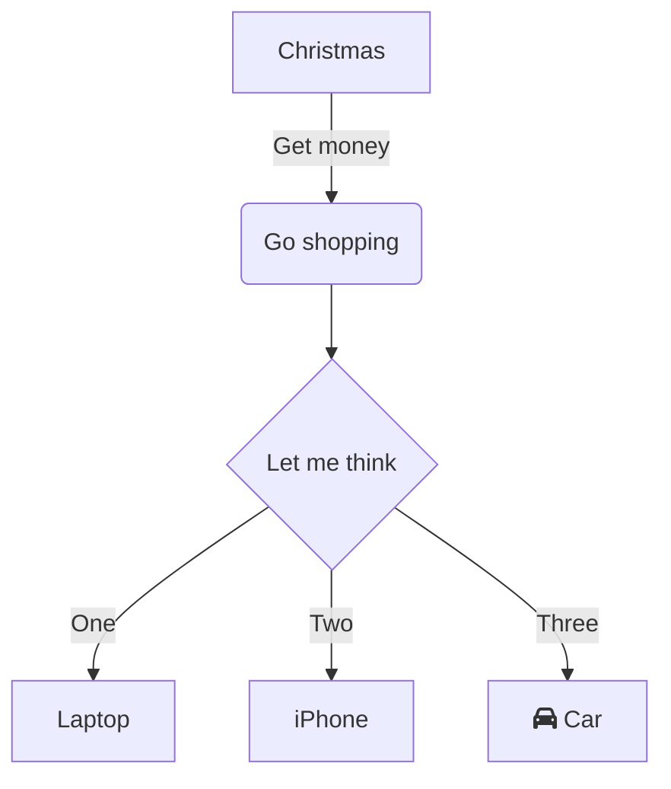
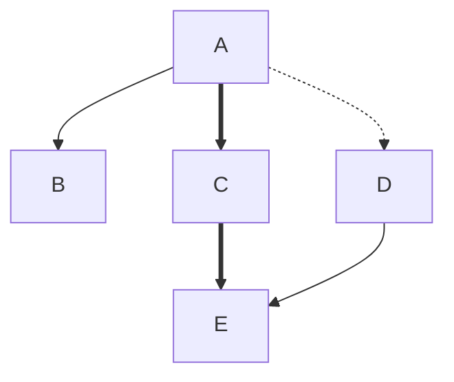

# mascii

Mermaid `flowchart` diagrams into ASCII.

## Example

Given this Mermaid source (`examples/default.mmd`):



`mascii` produces:

```
              ┌───────────┐
              │ Christmas │
              └───────────┘
                    │
                Get money
                    │
                    ▼
             ╭─────────────╮
             │ Go shopping │
             ╰─────────────╯
                    │
                    │
                    ▼
            ╭──────────────╮
            │ Let me think │
            ╰──────────────╯
             │    │       │
            One  Two    Three
        ╭────╯    │       ╰──╮
        ▼         ▼          ▼
┌────────┐    ┌────────┐    ┌───────────────┐
│ Laptop │    │ iPhone │    │ fa:fa-car Car │
└────────┘    └────────┘    └───────────────┘
```

Square brackets `[...]` render with sharp corners; round `(...)` and diamond `{...}` get rounded corners.

## Edge styles

Normal `-->`, thick `==>`, dotted `-.->`, and invisible `~~~` (layout-only):



```
         ┌───┐
         │ A │
         └───┘
          │┃┊
   ╭──────╯┃╰┄┄┄┄┄┄╮
   ▼       ▼       ▼
┌───┐    ┌───┐    ┌───┐
│ B │    │ C │    │ D │
└───┘    └───┘    └───┘
           ┃        │
           ┣────────╯
           ▼
         ┌───┐
         │ E │
         └───┘
```

Thick edges use heavy box-drawing (`┃ ━ ┏ ┓ ┗ ┛`), dotted use dashed (`┊ ┄`), and invisible edges still constrain the layout (note `B` is placed above `E` even without a visible line).

## Install

```sh
cargo install --path .
```

## Usage

```sh
mascii examples/default.mmd
cat diagram.mmd | mascii
```

### Options

- `--padding N` — horizontal padding inside boxes (default: 1)
- `--theme NAME` — `grey` (default), `mono`, `neon`, `dim`, `none`
- `--color WHEN` — `auto` (default), `always`, `never`
- `--no-color` — shortcut for `--color never`

## Supported Mermaid syntax

- `flowchart TD` / `flowchart LR`
- Node shapes: `[square]`, `(round)`, `{diamond}`
- Edges: `-->` normal, `==>` thick, `-.->` dotted, `~~~` invisible (layout only)
- Edge labels: `A -->|text| B` and `A -- text --> B`
- Chains: `A --> B --> C`
- Long edges (pass through intermediate layers)
- Fan-in merges, fan-out splits
